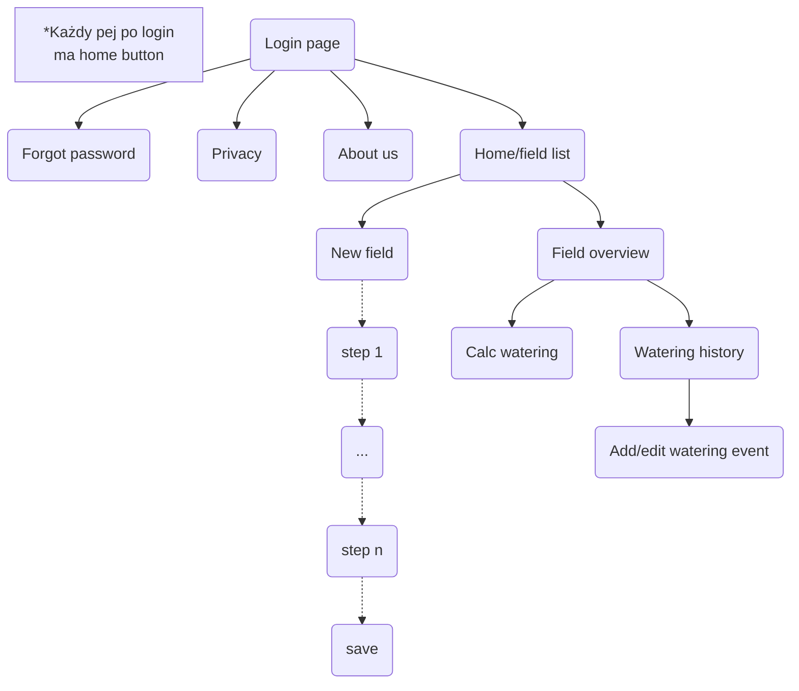

# WaterApp

# Initial setup
https://python.land/virtual-environments/virtualenv
```
pip install -r requirements.txt
```
 
# Kryteria:

a. Utwórz aplikację mobilną w technologii PWA, aby umożliwiać instalację oraz odinstalowanie z urządzenia mobilnego.

b. Zapewnij prawidłową prezentację treści na urządzeniu mobilnym, zgodnie z zasadą Mobile First. Możesz wykorzystać Bootstrap lub inny framework.

c. Utwórz aplikację SPA. Możesz wykorzystać Vue, Angular, React, czy inny framework.

d. Zaprojektuj i wykonaj aplikację w architekturze dwuwarstwowej.

e. Dodaj funkcjonalność uwierzytelniani użytkowników przy użyciu loginu i hasła oraz przy użyciu co najmniej jednego z kont z portali społecznościowych (wykorzystaj usługę Firebase Authentication).

f. Przechowuj dane w bazie danych zorientowanej na dokument (wykorzystaj usługę Cloud Firestore). Baza powinna zawierać co najmniej 3 kolekcje dokumentów. Zastosuj w dokumentach różne typy danych.

g. Wykorzystaj co najmniej 3 fizyczne funkcje urządzenia mobilnego (np. odbiornik gps, wibracja, kamera, itp.), których funkcjonalność będzie odnosiła się do tematu projektu.

h. Wykorzystaj dowolną wybraną usługę Firebase (oprócz Authentication i Cloud Firestore) (https://firebase.google.com/products)

# Tech stack:
- React.js
- FastAPI
- Firebase Authentication
- Cloud Firestore
- trzecia usługa z Firebase https://firebase.google.com/products-build

# App flow:

Endpoints:
* Logowanie
* Forgor password
* Privacy
* About us
* Profile
* Settings
* Home (field list)
* Field overview
* Calc watering
* Watering history
* New field
* Add/edit watering event

